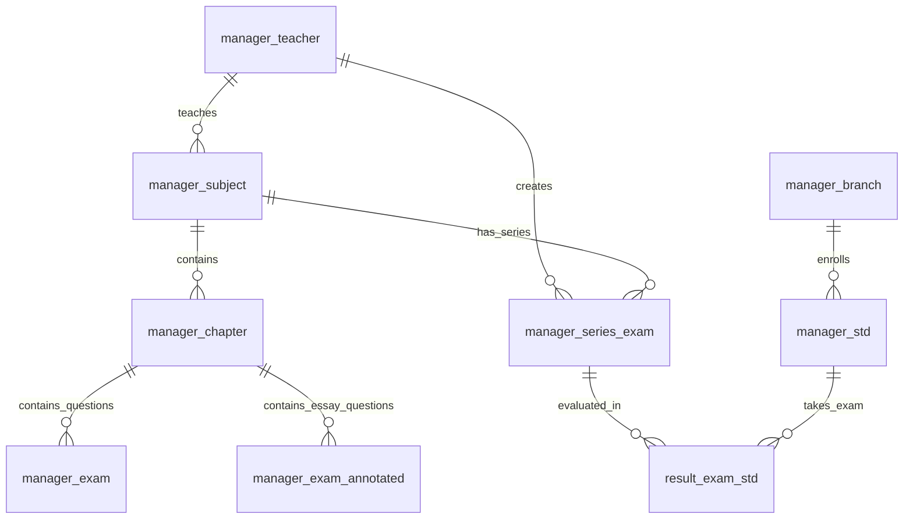

# โครงสร้างฐานข้อมูล (Database Schema Overview)

เอกสารนี้รวบรวมรายละเอียดโครงสร้างตาราง (Table Schemas) ชนิดข้อมูล (Data Types) และความสัมพันธ์ของฐานข้อมูลสำหรับ **ระบบข้อสอบออนไลน์ (Online Examination System)** โดยอ้างอิงจากไฟล์ฐานข้อมูล `C:\xampp\htdocs\examination\agents\db\chullamane_learn.sql` และคำสั่ง SQL ในโค้ดโปรเจกต์

---

## 1. ภาพรวมฐานข้อมูลและการเชื่อมต่อ (Database Connection Info)

* **Database Name**: `chullamane_learn4` (หลักบน Web) / `chullamane_learn` (SQL Dump) / `chullamane_dynamicip` (Mobile API)
* **Character Set / Collation**: `utf8mb4` / `utf8_general_ci` / `utf8mb3_general_ci`
* **Storage Engine**: `InnoDB`
* **ไฟล์การเชื่อมต่อ**: `connect.php` และ `Connect_app/include/db_connection.php`

---

## 2. ตารางผู้ใช้งาน (Users Schemas)

### 2.1 ตารางอาจารย์และผู้ดูแลระบบ (`manager_teacher`)
ใช้เก็บบัญชีผู้ใช้งานฝั่งอาจารย์และผู้ดูแลระบบ (Admin)

| ชื่อคอลัมน์ (Column) | ชนิดข้อมูล (Data Type) | Nullable | Primary/Key | คำอธิบาย (Description) |
| :--- | :--- | :--- | :--- | :--- |
| `id_teacher` | `int(11)` | **NO** | **PRIMARY KEY** (Auto Increment) | รหัสประจำตัวอาจารย์ |
| `name_teacher` | `varchar(30)` | **NO** | - | ชื่อ-นามสกุลอาจารย์ |
| `email_teacher` | `varchar(30)` | **NO** | - | อีเมลสำหรับ Login |
| `password_teacher` | `varchar(30)` | **NO** | - | รหัสผ่าน (Plaintext) |
| `status_teacher` | `int(2)` | **NO** | - | สถานะ/สิทธิ์การใช้งาน (`1` = Admin/ผู้ดูแลระบบ, `2` = อาจารย์ผู้สอน) |
| `gender_teacher` | `int(1)` | **NO** | - | คำนำหน้า/เพศ (`1` = นาย, `2` = นางสาว/นาง) |

---

### 2.2 ตารางนักเรียน/นักศึกษา (`manager_std`)
ใช้เก็บบัญชีผู้เรียน ข้อมูลชั้นเรียน และสิทธิ์การเข้าสอบ

| ชื่อคอลัมน์ (Column) | ชนิดข้อมูล (Data Type) | Nullable | Default | คำอธิบาย (Description) |
| :--- | :--- | :--- | :--- | :--- |
| `id` | `int(11)` | **NO** | **PRIMARY KEY** | ลำดับไอดี (Auto Increment) |
| `id_std` | `varchar(30)` | **NO** | - | รหัสนักศึกษา (ใช้สำหรับ Login) |
| `name_std` | `varchar(30)` | **NO** | - | ชื่อ-นามสกุลนักศึกษา |
| `year_std` | `varchar(10)` | **NO** | - | ปีการศึกษา (เช่น 2567) |
| `branch_id_std` | `int(2)` | **NO** | - | ไอดีสาขาวิชา (FK -> `manager_branch.branch_id`) |
| `genre_std` | `int(2)` | **NO** | - | กลุ่ม/ระดับการศึกษา (เช่น ปวช./ปวส.) |
| `degree_std` | `int(1)` | **NO** | `1` | ชั้นปี (เช่น 1, 2, 3) |
| `section_std` | `varchar(10)` | **NO** | `'1'` | ห้อง/กลุ่มเรียน (Section) |
| `password_std` | `varchar(30)` | **NO** | - | รหัสผ่าน (Plaintext) |
| `gender_std` | `int(2)` | **NO** | - | เพศ/คำนำหน้า (`1` = นาย, `2` = นางสาว) |
| `IsUse` | `int(2)` | **NO** | `1` | สถานะการใช้งาน (`1` = ใช้งานปกติ, `0` = ระงับ) |

---

## 3. ตารางรายวิชาและบทเรียน (Subject & Chapter Schemas)

### 3.1 ตารางรายวิชา (`manager_subject`)
ใช้เก็บข้อมูลวิชาที่เปิดสอนและอาจารย์ผู้รับผิดชอบ

| ชื่อคอลัมน์ (Column) | ชนิดข้อมูล (Data Type) | Nullable | Primary/Key | คำอธิบาย (Description) |
| :--- | :--- | :--- | :--- | :--- |
| `id` | `int(11)` | **NO** | **PRIMARY KEY** | ไอดีรายวิชา |
| `id_subject` | `varchar(100)` | **NO** | - | รหัสวิชา (เช่น 20001-1001) |
| `name_subject` | `varchar(300)` | **NO** | - | ชื่อรายวิชา |
| `name_teacher_subject` | `int(4)` | **NO** | - | ไอดีอาจารย์ผู้สอน (FK -> `manager_teacher.id_teacher`) |
| `genre_subject` | `int(1)` | **NO** | `1` | ประเภทวิชา |
| `term_subject` | `varchar(30)` | **NO** | - | ภาคเรียน/ปีการศึกษา (เช่น 1/2567) |
| `ans_type_subject` | `int(11)` | **NO** | - | รูปแบบตัวเลือกคำตอบ (`1` = ก,ข,ค, `2` = a,b,c, `3` = 1,2,3) |

---

### 3.2 ตารางบทเรียน/หน่วยการเรียนรู้ (`manager_chapter`)
ใช้แบ่งหมวดหมู่ข้อสอบตามบทเรียนของแต่ละวิชา

| ชื่อคอลัมน์ (Column) | ชนิดข้อมูล (Data Type) | Nullable | Primary/Key | คำอธิบาย (Description) |
| :--- | :--- | :--- | :--- | :--- |
| `id` | `int(11)` | **NO** | **PRIMARY KEY** | ไอดีบทเรียน |
| `num_chapter` | `int(4)` | YES | NULL | ลำดับบทเรียน (เช่น บทที่ 1) |
| `name_chapter` | `text` | **NO** | - | ชื่อบทเรียน/หัวข้อ |
| `objective_chapter` | `text` | YES | NULL | จุดประสงค์การเรียนรู้ |
| `name_name_subject` | `int(4)` | **NO** | - | ไอดีวิชาที่สังกัด (FK -> `manager_subject.id`) |

---

## 4. ตารางชุดข้อสอบ (Exams / Exam Series Schemas)

### 4.1 ตารางชุดข้อสอบ (`manager_series_exam`)
ใช้จัดการจัดชุดข้อสอบ กำหนดเวลาสอบ และเงื่อนไขการสอบ

| ชื่อคอลัมน์ (Column) | ชนิดข้อมูล (Data Type) | Nullable | Default | คำอธิบาย (Description) |
| :--- | :--- | :--- | :--- | :--- |
| `id` | `int(11)` | **NO** | **PRIMARY KEY** | ไอดีชุดข้อสอบ |
| `id_subject_series_exam` | `int(4)` | **NO** | - | ไอดีวิชาที่จัดสอบ (FK -> `manager_subject.id`) |
| `branch_id_series_exam` | `int(11)` | **NO** | - | ไอดีสาขาวิชาที่ให้สอบ |
| `year_std_series_exam` | `varchar(100)` | **NO** | - | ชั้นปี/กลุ่มนักศึกษาที่มีสิทธิ์สอบ |
| `name_series_exam` | `text` | **NO** | - | ชื่อชุดข้อสอบ |
| `type_exam` | `varchar(30)` | **NO** | - | ประเภทการสอบ (เช่น `type1`, `type2`) |
| `teacher_id_series_exam` | `int(3)` | **NO** | - | อาจารย์ผู้สร้างชุดข้อสอบ (FK -> `manager_teacher.id_teacher`) |
| `datetime_start_series_exam` | `text` | **NO** | - | วัน-เวลาเริ่มเปิดให้สอบ |
| `datetime_end_series_exam` | `text` | **NO** | - | วัน-เวลาปิดการสอบ |
| `list_series_exam` | `text` | **NO** | - | รายการไอดีข้อสอบที่ดึงมาใช้ (เก็บเป็นข้อความคั่นด้วย comma เช่น `10,12,15`) |
| `score_series_exam` | `text` | **NO** | - | คะแนนของแต่ละข้อ |
| `type_series_exam` | `text` | **NO** | - | รูปแบบย่อยของชุดข้อสอบ |
| `approve_series_exam` | `varchar(30)` | **NO** | - | สถานะอนุมัติให้สอบ (`1` = เปิดสอบ, `0` = ปิด) |
| `auto_re_series_exam` | `int(2)` | **NO** | `0` | แฟล็กอนุญาตให้สอบซ้ำอัตโนมัติ |

---

## 5. ตารางโจทย์ ตัวเลือก และเฉลย (Questions & Options Schemas)

### 5.1 ตารางคลังข้อสอบปรนัย (`manager_exam`)
ใช้เก็บโจทย์ข้อสอบ ตัวเลือก 1-5 ภาพประกอบโจทย์/ตัวเลือก และเฉลยข้อที่ถูกต้อง

| ชื่อคอลัมน์ (Column) | ชนิดข้อมูล (Data Type) | Nullable | Primary/Key | คำอธิบาย (Description) |
| :--- | :--- | :--- | :--- | :--- |
| `id` | `int(11)` | **NO** | **PRIMARY KEY** | ไอดีข้อสอบ |
| `proposition_exam` | `text` | **NO** | - | ข้อความโจทย์คำถาม |
| `proposition_img_exam` | `varchar(100)` | YES | NULL | ชื่อไฟล์รูปภาพประกอบโจทย์ |
| `answer1_exam` | `text` | **NO** | - | ข้อความตัวเลือกที่ 1 |
| `answer1_img_exam` | `varchar(100)` | YES | NULL | ชื่อไฟล์รูปภาพตัวเลือกที่ 1 |
| `answer2_exam` | `text` | **NO** | - | ข้อความตัวเลือกที่ 2 |
| `answer2_img_exam` | `varchar(100)` | YES | NULL | ชื่อไฟล์รูปภาพตัวเลือกที่ 2 |
| `answer3_exam` | `text` | **NO** | - | ข้อความตัวเลือกที่ 3 |
| `answer3_img_exam` | `varchar(100)` | YES | NULL | ชื่อไฟล์รูปภาพตัวเลือกที่ 3 |
| `answer4_exam` | `text` | **NO** | - | ข้อความตัวเลือกที่ 4 |
| `answer4_img_exam` | `varchar(100)` | YES | NULL | ชื่อไฟล์รูปภาพตัวเลือกที่ 4 |
| `answer5_exam` | `text` | **NO** | - | ข้อความตัวเลือกที่ 5 |
| `answer5_img_exam` | `varchar(100)` | **NO** | - | ชื่อไฟล์รูปภาพตัวเลือกที่ 5 |
| `result_exam` | `int(1)` | **NO** | - | เฉลยคำตอบที่ถูกต้อง (`1`, `2`, `3`, `4`, หรือ `5`) |
| `chapter_id_exam` | `int(11)` | **NO** | - | ไอดีบทเรียนที่สังกัด (FK -> `manager_chapter.id`) |

---

### 5.2 ตารางข้อสอบอัตนัย/อธิบาย (`manager_exam_annotated`)
ใช้เก็บข้อสอบประเภทอัตนัย หรือข้อสอบที่ต้องตรวจด้วยมือ

| ชื่อคอลัมน์ (Column) | ชนิดข้อมูล (Data Type) | Nullable | Primary/Key | คำอธิบาย (Description) |
| :--- | :--- | :--- | :--- | :--- |
| `id` | `int(11)` | **NO** | **PRIMARY KEY** | ไอดีข้อสอบอัตนัย |
| `proposition_exam` | `text` | **NO** | - | ข้อความโจทย์คำถาม |
| `proposition_img_exam` | `varchar(100)` | **NO** | - | รูปภาพประกอบโจทย์ |
| `ans_exam` | `text` | **NO** | - | แนวทางการตอบ/เฉลยอัตนัย |
| `chapter_id_exam` | `int(11)` | **NO** | - | ไอดีบทเรียน (FK -> `manager_chapter.id`) |

---

## 6. ตารางผลการสอบและคำตอบ (Exam Results Schemas)

### 6.1 ตารางบันทึกการส่งข้อสอบและคะแนน (`result_exam_std`)
ใช้เก็บบันทึกการทำข้อสอบ คำตอบที่นักเรียนเลือก และคะแนนที่ได้ในการสอบแต่ละครั้ง

| ชื่อคอลัมน์ (Column) | ชนิดข้อมูล (Data Type) | Nullable | Default | คำอธิบาย (Description) |
| :--- | :--- | :--- | :--- | :--- |
| `id` | `int(11)` | **NO** | **PRIMARY KEY** | ไอดีผลการสอบ |
| `id_std_result_exam` | `varchar(50)` | **NO** | - | รหัสนักศึกษาผู้เข้าสอบ (`id_std`) |
| `id_name_series_exam` | `int(5)` | **NO** | - | ไอดีชุดข้อสอบที่สอบ (FK -> `manager_series_exam.id`) |
| `exam_result_exam` | `text` | **NO** | - | รายการไอดีข้อสอบที่สุ่ม/จัดให้สอบ |
| `ans_result_exam` | `text` | **NO** | - | รายการคำตอบที่นักศึกษาเลือกทำ |
| `result_result_exam` | `text` | **NO** | - | ผลการตรวจคำตอบรายข้อ (`1` = ถูก, `0` = ผิด) |
| `point_result_exam` | `text` | **NO** | - | สรุปคะแนนรวมที่ได้ |
| `status_result_exam_std` | `int(2)` | **NO** | `0` | สถานะการสอบ (`1` = ส่งข้อสอบแล้ว, `0` = กำลังสอบ/ยังไม่ส่ง) |

---

## 7. ความสัมพันธ์ระหว่างตารางหลัก (Entity Relationships)

---

## 8. ข้อสังเกตโครงสร้างและการออกแบบ (Design Insights)

1. **Storage Pattern สำหรับตัวเลือกข้อสอบ**:
   * ตาราง `manager_exam` รวมตัวเลือก 1-5 (`answer1_exam` ถึง `answer5_exam`) และรูปภาพตัวเลือกไว้ในแถว (Row) เดียวกัน แทนที่จะแยกเป็นตาราง `options` ต่างหาก
2. **Storage Pattern สำหรับรายการข้อสอบและคำตอบ**:
   * ตาราง `manager_series_exam` และ `result_exam_std` ใช้คอลัมน์ชนิด `text` ในการเก็บบาร์/สตริงคั่นด้วยเครื่องหมายจุลภาค (Comma-separated values) สำหรับรายการข้อสอบ (`list_series_exam`) และคำตอบที่นักเรียนเลือก (`ans_result_exam`)
3. **การขาด Foreign Key Constraints ในระดับ DB Engine**:
   * ความสัมพันธ์ระหว่างตารางควบคุมผ่าน Application Logic ในโค้ด PHP (ไม่ได้ตั้งค่า `FOREIGN KEY ... REFERENCES` ชัดเจนใน DDL)
